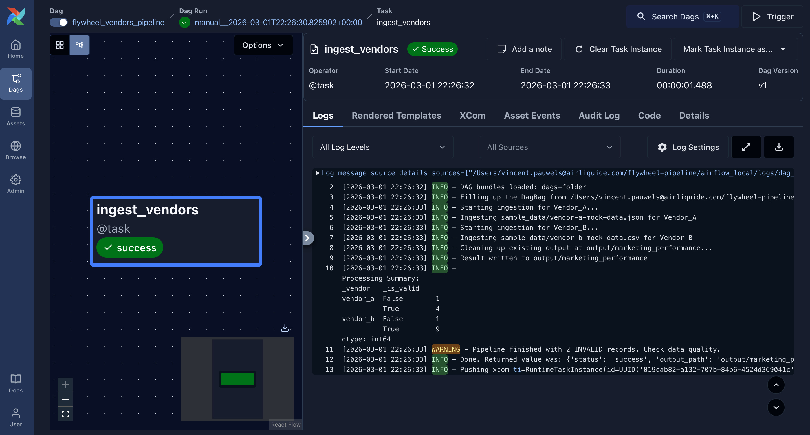

# Flywheel data pipeline assessment

This repository contains the implementation of a data pipeline for ingesting, standardizing, and validating marketing data from multiple vendors.

The pipeline generates partitioned Parquet files in the `output/` directory, simulating an S3 bucket structure.

### Documentation
- [**Design**](DESIGN.md): Detailed data model and partitioning strategy.
- [**Solution**](SOLUTION.md): Implementation choices, trade-offs, and future improvements.
- [**AI Prompts**](AI_PROMPTS.md): Prompts record
- [**Data presentation**](data_presentation.ipynb): Jupyter notebook demonstrating analysis and visualization.

### Project Structure

```text
├── flywheel/              
│   ├── config.py           # Vendor configurations & schema definitions
│   ├── pipeline.py         # Main pipeline
│   └── core/               
│       ├── ingestion.py    # File reading & schema normalization
│       └── validation.py   # Data quality checks & standardization
├── dags/                   # Airflow DAGs definitions
├── tests/                  # unit & integration (pytest)
├── sample_data/            # Local source files (simulating vendor drops)
├── output/                 # Simulated Data Lake (Parquet output)
├── data_presentation.ipynb # Simple notebook to present the data
├── Makefile                # Shortcuts for dev tasks (test, lint, run, airflow standalone)
├── pyproject.toml          # Dependencies (uv)
```

*Note that the notebook is only here for a simple presentation of the data but we shouldn't do analytics on the ingested data in production but rather have a raw (source) -> bronze (ingested) -> silver -> gold -> mart (fct/dim) transformation pipeline to do analytics and dashboards. dbt + duckdb would be a good fit there.*

### Getting started
```bash
uv venv --python 3.13
source .venv/bin/activate
uv sync --all-groups
```

### Run locally
```bash
uv run python -m flywheel.pipeline
```

### Output layout (simulated S3)
Each run writes two layers under `output/`:

- Raw landing layer (source files copied as-is): `output/raw/_ingestion_date=YYYY-MM-DD/_vendor=vendor_x/<source-file>`
- Curated layer (Parquet): `output/marketing_performance/_event_date=YYYY-MM-DD/_vendor=vendor_x/part-*.parquet`

The raw layer is a local simulation of an S3 landing zone. Curated ingestion reads from this raw layer (not directly from `sample_data`), while keeping replayable source files separate from the analytics table.

### Run in local Airflow
1. Add a `.env` following the `.env.example` at the project root. 
2. Run:
```bash
make airflow
```



### Contributing

1. Install dependencies:
   ```bash
   uv sync --all-groups
   ```

2. Run the full validation suite:
   ```bash
   uv run pytest
   uv run ruff format .
   uv run ty check
   ```
   or
   ```bash
   make all
   ```
*see the [Makefile](Makefile)*